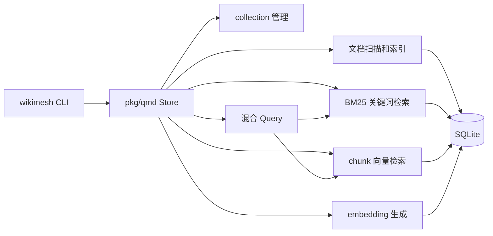

# Wikimesh

Wikimesh 是一个 Go 实现的本地文档 collection 管理和检索工具。它把文档扫描、索引、embedding、关键词检索、向量检索和混合查询集中在一个可本地运行的 CLI 与 SDK 中，适合给项目文档、知识库和代码说明建立可查询的本地索引。

项目里的 qmd 能力位于 [`pkg/qmd`](pkg/qmd/README.md)，它是参考 [tobi/qmd](https://github.com/tobi/qmd) 项目设计做出的 Go 简化实现。当前实现以本仓库 Go 代码为准，不要求和上游项目在每个接口、命令和内部细节上完全一致。

## 项目结构

```text
cmd/wikimesh        CLI 入口，只负责启动命令
internal/cli       CLI 命令编排、配置加载和 JSON 输出
pkg/qmd            qmd 风格检索 SDK 的公共 API
pkg/qmd/internal   qmd SDK 私有实现：抽取、索引、embedding、llama.cpp 运行时
```

核心边界：

- CLI 只依赖 `github.com/JieWaZi/wikimesh/pkg/qmd`，不直接依赖 `pkg/qmd/internal/...`。
- `pkg/qmd/internal/...` 不反向依赖 `github.com/JieWaZi/wikimesh/pkg/qmd`。
- SDK 的公开 API 不暴露 SQLite、FTS、chunk、向量表或本地模型运行时的内部类型。
- 根目录 `internal` 保留应用层私有代码；qmd 的实现细节保留在 `pkg/qmd/internal`。

## 能力概览



Wikimesh 当前支持：

- 管理 collection：新增、列出、删除和刷新索引。
- 建立文档索引：扫描 Markdown/文本文件，写入文档级 FTS 和 chunk 索引。
- 生成向量：对已索引 chunk 写入 embedding 向量，支持按 collection 过滤和强制重建。
- 关键词检索：基于 SQLite FTS5 和 BM25。
- 向量检索：基于 chunk embedding，按文档去重并保留最佳 chunk。
- 混合查询：同时召回关键词和向量结果，做 RRF 融合，并可接入 query expansion 与 reranker。
- 本地模型管理：下载配置中的 GGUF 模型，安装 llama.cpp 运行时动态库。

## 快速使用

构建或直接运行 CLI：

```sh
go run ./cmd/wikimesh --help
make build
.wikimesh/bin/wikimesh --help
```

首次使用时，CLI 会按需生成 `.wikimesh/wikimesh.yaml`。也可以手动添加 collection：

```sh
wikimesh collection add ./docs --name docs
wikimesh collection list
wikimesh collection update docs
```

如果需要向量检索或混合查询，先下载模型、安装本地运行时并生成 embedding：

```sh
wikimesh model download all
wikimesh model lib install
wikimesh embed --collection docs
```

执行检索：

```sh
wikimesh search "collection 配置"
wikimesh vsearch "如何刷新文档索引"
wikimesh query "Wikimesh 如何执行混合查询？" --no-rerank
```

所有检索命令默认输出 JSON，便于脚本或其他工具消费。

## 配置文件

默认配置路径是 `.wikimesh/wikimesh.yaml`，也可以通过 `--config` 或 `-c` 指定：

```sh
wikimesh --config ./wikimesh.yaml collection list
```

一个最小配置示例：

```yaml
db_path: .wikimesh/wiki.db
chunk_size: 900
chunk_overlap: 0.15
embedding:
  provider: local
  model: .wikimesh/models/Qwen3-Embedding-0.6B-Q8_0.gguf
collections:
  docs:
    path: ./docs
    pattern: "**/*.md"
```

`collections` 使用 qmd 风格的 map 结构。`includeByDefault: false` 可以让某个 collection 默认不参与顶层 `search`、`vsearch` 和 `query`。

## 开发验证

修改 Go 代码后至少运行：

```sh
gofmt -w <changed-go-files>
go test ./...
```

涉及架构边界、依赖关系或公共 API 时，还应运行：

```sh
go vet ./...
go list -f '{{.ImportPath}} -> {{join .Imports ","}}' ./...
```

本仓库的 `Makefile` 提供了常用命令：

```sh
make test
make build
make install-llama
make package
```

## SDK 文档

`pkg/qmd` 是项目的公共检索 SDK。它的架构图、查询设计、配置字段和 Go 代码示例见 [`pkg/qmd/README.md`](pkg/qmd/README.md)。
