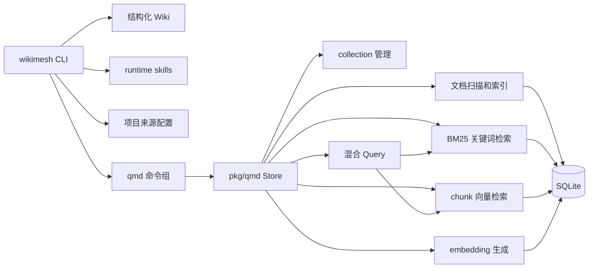

# Wikimesh

Wikimesh 是一个用 Go 实现的本地知识库、结构化 Wiki 和文档 collection 管理工具。它把 Wiki 工作区、文档扫描、SQLite/FTS 索引、embedding、关键词检索、向量检索、混合查询和 runtime skill 安装集中在一个可本地运行的 CLI 与 SDK 中。

当前项目包含两层能力：

- `wikimesh` CLI：初始化和维护结构化 Wiki，安装 runtime skills，管理项目来源，读取和搜索 Topic/Workflow 页面。
- `pkg/qmd` SDK：管理 collection、刷新索引、生成 embedding，并提供关键词检索、向量检索和混合 Query。

qmd 能力位于 [`pkg/qmd`](pkg/qmd/README.md)。它参考 [tobi/qmd](https://github.com/tobi/qmd) 的 collection、索引和混合检索思路实现，但公开 API、配置字段、命令形态和内部细节以本仓库当前 Go 代码为准。

## 项目结构

```text
cmd/wikimesh                         CLI 入口，只负责构造并启动根命令
internal/cli                         CLI 根命令和一级命令装配
internal/cli/wiki                    Wiki 命令组：init/read/search/glossary/repo/check
internal/cli/qmd                     qmd 命令组：collection/update/search/query/embed/model
internal/cli/skill                   runtime skill 安装命令
internal/app/qmdapp                  CLI 使用 qmd SDK 的应用服务
internal/app/wikiapp                 Wiki 项目配置、页面解析和搜索适配
internal/app/wikiinit                wikimesh init 的工作区创建、配置登记和模板
internal/app/skillapp                runtime skill 来源解析、发现、安装和 reference 同步
internal/app/updateapp                自更新服务
internal/ui                          CLI logo、中文 help、交互组件和集中 i18n 文案
pkg/qmd                              qmd 风格检索 SDK 的公共 API
pkg/qmd/embed                        embedding 后端和 llama.cpp 调用
pkg/qmd/extract                      文档读取、标题提取和 chunk 切分
pkg/qmd/index                        SQLite、FTS5、chunk 元数据和向量表
pkg/qmd/llamaruntime                 llama.cpp 运行时库安装
skills/devwiki                       本仓库内置的 DevWiki runtime skills
skills/devwiki/share-references      DevWiki skills 共享引用源，由 reference-groups.yaml 映射到各 skill
```

核心边界：

- `cmd/wikimesh` 只保留进程入口；命令树集中在 `internal/cli`。
- Wiki 相关命令统一位于 `internal/cli/wiki`，其中 `init` 只做命令编排、参数归一化和交互收集，创建工作区等业务逻辑位于 `internal/app/wikiinit`。
- CLI 通过 `internal/app/qmdapp` 和 `github.com/JieWaZi/wikimesh/pkg/qmd` 使用检索能力，不直接编排 SQLite、FTS、chunk 或向量表细节。
- `pkg/qmd/embed`、`pkg/qmd/extract`、`pkg/qmd/index`、`pkg/qmd/llamaruntime` 是 qmd 底层组件包，不反向依赖 `pkg/qmd` 的 SDK 门面。
- SDK 的公开 API 不暴露 SQLite、FTS、chunk、向量表或本地模型运行时的内部类型。
- 根目录 `internal` 保留 CLI 和应用层私有代码；可被外部复用的检索 API 放在 `pkg/qmd`。
- CLI 用户可见文案集中在 `internal/ui`，命令实现不直接散落展示字符串。

## 能力概览



Wikimesh 当前支持：

- 初始化 Wikimesh/DevWiki 工作区，生成 `raw/`、`wiki/`、`.wikimesh/qmd.yaml` 和目标 agent 的运行时入口文件。
- 安装本仓库内置 runtime skills；当前内置 Wiki 类型是 `devwiki`，面向软件工程知识库。
- 维护 DevWiki runtime skills 的共享引用；`share-references/` 是源文件，`reference-groups.yaml` 声明需要同步到哪些 skill。
- 读取和搜索 `topic` / `workflow` 页面视图，并校验一等知识页面的 `card`、`core`、`explain` section。
- 管理项目来源：登记本地或远端 Wiki 项目、关联代码仓、切换当前激活来源、输出来源配置。
- 管理 qmd collection：新增、列出、删除和刷新索引。
- 扫描 Markdown/文本文件，写入文档级 FTS、chunk FTS、chunk 元数据和向量表。
- 为已索引 chunk 生成 embedding，支持按 collection 过滤、覆盖模型配置和强制重建。
- 执行关键词检索、向量检索和混合查询；结果默认以缩进 JSON 输出，便于脚本和 agent 消费。
- 按需下载配置中的 GGUF 模型，并安装 llama.cpp 运行时动态库。
- 从 GitHub Release 自更新当前 Wikimesh 可执行文件，并校验 `checksums.txt`。

## 安装

Linux / macOS 可通过 GitHub Release 中的安装脚本安装最新版本：

```sh
curl -fsSL https://github.com/JieWaZi/wikimesh/releases/latest/download/install.sh | sh
```

安装脚本会自动识别系统和架构，下载对应的 release 压缩包，校验 `checksums.txt` 后安装 `wikimesh`。默认安装到 `/usr/local/bin`；如果无写入权限且无法使用 `sudo`，会回退到 `~/.local/bin`。

指定版本安装：

```sh
VERSION=v0.1.0 curl -fsSL https://github.com/JieWaZi/wikimesh/releases/latest/download/install.sh | sh
```

指定安装目录：

```sh
WIKIMESH_INSTALL_DIR="$HOME/.local/bin" curl -fsSL https://github.com/JieWaZi/wikimesh/releases/latest/download/install.sh | sh
```

Windows PowerShell：

```powershell
iwr https://github.com/JieWaZi/wikimesh/releases/latest/download/install.ps1 -UseBasicParsing | iex
```

安装完成后，后续可直接更新 `wikimesh` 自身：

```sh
wikimesh update
```

`wikimesh update` 会从 GitHub Release 下载 `checksums.txt`，按当前系统和架构选择匹配的压缩包，校验 SHA256 后替换当前正在运行的 `wikimesh`。Windows 会在当前进程退出后延迟替换，请重新打开终端后继续使用。

### 本地 GGUF 按需安装

Release 安装包默认只安装 `wikimesh` 二进制，不会在安装或编译阶段自动下载 llama.cpp 运行时库和 GGUF 模型。只使用 Wiki 初始化、页面读取、关键词搜索、repo 管理、skill 安装，或 qmd 的 API/Ollama 后端时，不需要额外安装本地 GGUF 运行时。

如果需要使用本地 GGUF 模型执行 embedding、向量检索、混合查询、query expansion 或 rerank，安装完成后在目标工作区执行：

```sh
wikimesh qmd model lib install
wikimesh qmd model download all
```

`wikimesh qmd model lib install` 默认把 llama.cpp 动态库安装到 `.wikimesh/lib`。如需指定后端，可使用 `--processor cpu|metal|cuda|vulkan|rocm`；例如 Apple Silicon 上可执行：

```sh
wikimesh qmd model lib install --processor metal
```

也可以通过 `WIKIMESH_YZMA_LIB` 或 `YZMA_LIB` 指向已有的 llama.cpp 动态库目录。

## 快速开始

构建或直接运行 CLI：

```sh
go run ./cmd/wikimesh --help
make build
.wikimesh/bin/wikimesh --help
```

初始化一个 DevWiki 工作区：

```sh
wikimesh init "My Project" --agent codex --code-dir . --yes
```

初始化会在当前目录下按项目名 slug 创建工作区目录，并把项目级 runtime 目录写入该工作区的 `.gitignore`。项目信息写入用户级 Wikimesh 配置目录，不再在文档库内生成 `config/project.yaml`。常见目录如下：

```text
./my-project/
├── README.md
├── AGENTS.md 或 CLAUDE.md
├── raw/
│   ├── requirements/
│   ├── designs/
│   ├── features/
│   └── tests/
├── wiki/
│   ├── index.md
│   ├── glossary.md
│   ├── log.md
│   ├── topics/
│   ├── workflows/
│   ├── troubleshooting/
│   └── outputs/
└── .wikimesh/
    └── qmd.yaml
```

登记并查看 Wikimesh 项目来源：

```sh
wikimesh repo add "My Project" .
wikimesh repo link "My Project" app .
wikimesh repo use "My Project" local
wikimesh repo info
wikimesh repo info "My Project"
```

搜索和读取 Wiki 页面：

```sh
wikimesh search index "功能"
wikimesh search glossary "术语"
wikimesh search topic "功能边界"
wikimesh search workflow "索引刷新"
wikimesh read topic <slug> --view card
wikimesh read workflow <slug> --view core
wikimesh check document
```

更新当前安装的 Wikimesh 可执行文件：

```sh
wikimesh update
```

## qmd 使用

默认 qmd 配置路径是当前工作区的 `.wikimesh/qmd.yaml`。如果配置不存在，qmd 命令会按默认值创建它。

新增、查看和刷新 collection：

```sh
wikimesh qmd collection add ./docs --name docs
wikimesh qmd collection list
wikimesh qmd collection update
wikimesh qmd update
wikimesh qmd update --pull
wikimesh qmd status
```

如果需要本地 GGUF 向量检索或混合查询，先安装 llama.cpp 运行时库、下载模型，再生成 embedding：

```sh
wikimesh qmd model lib install
wikimesh qmd model download all
wikimesh qmd embed --collection docs
```

执行 qmd 检索：

```sh
wikimesh qmd search "collection 配置" --collection docs
wikimesh qmd vsearch "如何刷新文档索引" --collection docs
wikimesh qmd query "Wikimesh 如何执行混合查询？" --collection docs --no-rerank
```

常用选项：

- `--collection, -c <name>`：限制目标 collection，可重复传入。
- `--limit, -n <number>`：限制返回条数。
- `--all`：返回更大的结果集。
- `--min-score <score>`：设置最低分数。
- `wikimesh qmd update --pull`：刷新索引前执行 collection 配置中的 `update` 命令。
- `wikimesh qmd vsearch --raw`：只使用原始 query 做纯向量检索，不使用 query expansion。
- `wikimesh qmd embed --force`：重新生成已存在的 embedding。

`wikimesh qmd search`、`wikimesh qmd vsearch` 和 `wikimesh qmd query` 默认输出 JSON。顶层 `wikimesh search` 面向 Wiki 页面导航，默认输出 Markdown 表格。

## 配置文件

`.wikimesh/qmd.yaml` 使用 qmd 风格的 map 结构管理 collections：

```yaml
db_path: .wikimesh/wiki.db
chunk_size: 900
chunk_overlap: 0.15
models:
  embed: hf:Qwen/Qwen3-Embedding-0.6B-GGUF/Qwen3-Embedding-0.6B-Q8_0.gguf
  rerank: hf:ggml-org/Qwen3-Reranker-0.6B-Q8_0-GGUF/qwen3-reranker-0.6b-q8_0.gguf
  generate: hf:tobil/qmd-query-expansion-1.7B-gguf/qmd-query-expansion-1.7B-q4_k_m.gguf
embedding:
  provider: local
  model: .wikimesh/models/Qwen3-Embedding-0.6B-Q8_0.gguf
query_expansion:
  provider: local
  model: .wikimesh/models/qmd-query-expansion-1.7B-q4_k_m.gguf
reranker:
  provider: local
  model: .wikimesh/models/qwen3-reranker-0.6b-q8_0.gguf
collections:
  docs:
    path: ./docs
    pattern: "**/*.md"
    context:
      api/: SDK 文档
  raw:
    path: ./raw
    pattern: "**/*.md"
    includeByDefault: false
```

字段说明：

- `db_path`：SQLite 数据库路径，默认 `.wikimesh/wiki.db`。
- `chunk_size`：chunk 大小，默认 `900`。
- `chunk_overlap`：相邻 chunk 重叠比例，默认 `0.15`。
- `models`：模型来源，支持 qmd 当前实现可解析的来源格式。
- `embedding`、`query_expansion`、`reranker`：本地模型角色配置。
- `collections.<name>.path`：collection 扫描根目录。
- `collections.<name>.pattern`：默认扫描 `**/*.md`。
- `collections.<name>.include` / `ignore`：额外包含或忽略规则。
- `collections.<name>.update`：刷新 collection 前可执行的命令。
- `collections.<name>.includeByDefault: false`：让该 collection 默认不参与顶层 `search`、`vsearch` 和 `query`。
- `collections.<name>.context`：为路径前缀补充上下文说明。

## 主要命令

```text
wikimesh init                         初始化 Wikimesh 工作区
wikimesh update                       更新当前 Wikimesh 可执行文件
wikimesh search                       搜索 index/glossary/topic/workflow
wikimesh read                         读取 topic/workflow 的指定 view
wikimesh glossary keywords            输出 glossary 第一列关键词
wikimesh check document               校验 Wiki 页面结构
wikimesh repo add/info/link/use        管理 Wikimesh 项目来源
wikimesh skill install                安装 runtime skills
wikimesh qmd collection ...           管理 qmd collection
wikimesh qmd status                   查看 qmd 索引和集合状态
wikimesh qmd update                   刷新所有 qmd 集合索引
wikimesh qmd search                   执行文档级关键词检索
wikimesh qmd vsearch                  执行 chunk 级向量检索
wikimesh qmd query                    执行混合查询
wikimesh qmd embed                    为已索引 chunk 生成 embedding
wikimesh qmd model download           下载配置中的 GGUF 模型
wikimesh qmd model lib install        安装 llama.cpp 运行时库
```

查看准确参数时，以当前二进制的 help 输出为准：

```sh
wikimesh --help
wikimesh qmd --help
wikimesh qmd query --help
wikimesh repo --help
```

## 开发验证

修改 Go 代码后至少运行：

```sh
gofmt -w <changed-go-files>
go test ./...
```

本仓库的 `Makefile` 提供了常用入口：

```sh
make test
make build
make package
make clean
```

本地 Go 环境如果出现标准库编译版本不一致，可按 Makefile 的方式清理 `GOROOT` 并使用项目内构建缓存：

```sh
env -u GOROOT GOCACHE=$(pwd)/.cache/go-build go test ./...
```

涉及架构边界、依赖方向或公共 API 时，还应运行：

```sh
go vet ./...
go list -f '{{.ImportPath}} -> {{join .Imports ","}}' ./...
```

启用本地提交前校验：

```sh
git config core.hooksPath .githooks
```

当前 pre-commit hook 会运行 DevWiki skill reference 一致性测试，确保 `skills/devwiki/share-references/*.md` 已按 `skills/devwiki/reference-groups.yaml` 同步到各 skill 的 `references/` 目录。Wikimesh 当前不提供 `wikimesh skill refs sync` 命令；维护共享引用时直接修改 `share-references/`、更新 `reference-groups.yaml`，再运行：

```sh
env -u GOROOT GOCACHE=$(pwd)/.cache/go-build go test ./internal/app/skillapp -run 'TestDevwikiReferenceGroupsAreSyncable|TestDevwikiSharedReferencesAreComplete|TestDevwikiSkillReferencesAreMinimal'
```

## SDK 文档

`pkg/qmd` 是项目的公共检索 SDK。它的包边界、索引架构、查询设计、配置字段、扩展点和 Go 示例见 [`pkg/qmd/README.md`](pkg/qmd/README.md)。
