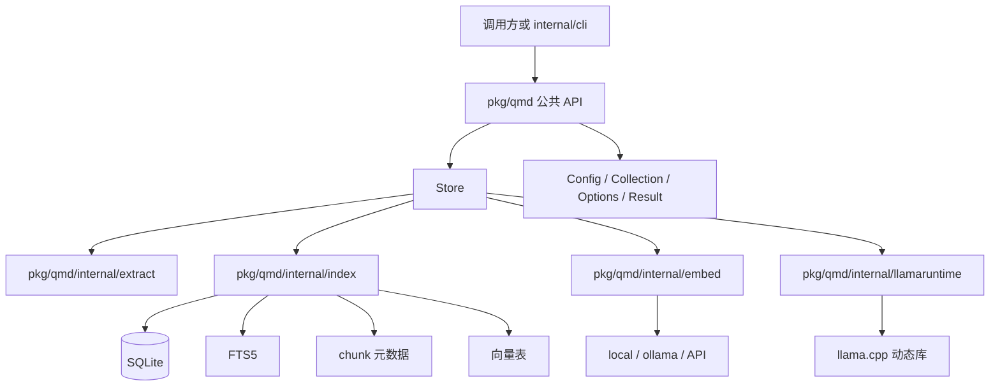
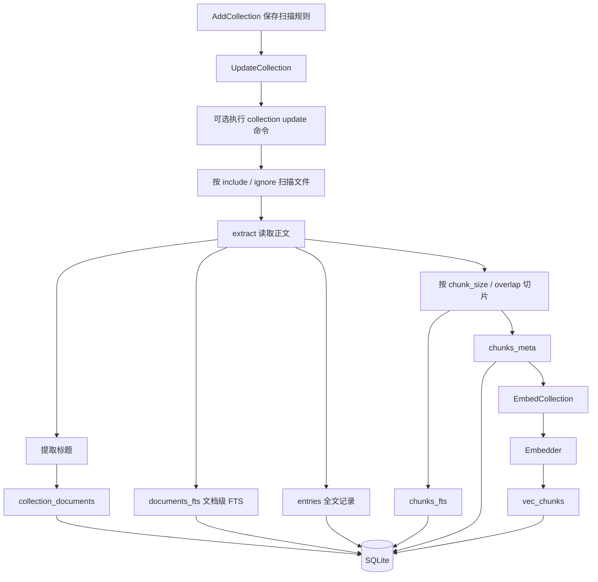
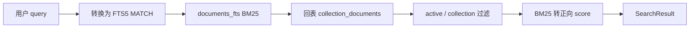
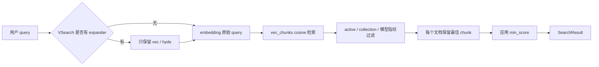

# pkg/qmd

`pkg/qmd` 是 Wikimesh 的 qmd 风格检索 SDK。它是参考 [tobi/qmd](https://github.com/tobi/qmd) 项目设计做出的 Go 简化实现：保留 collection、索引、embedding、关键词检索、向量检索和混合 Query 的核心思路，但公开 API、配置形态和具体命令以当前 Go 实现为准。

当前 SDK 的入口是 `NewStore` 创建的 `Store`。调用方只依赖 `github.com/JieWaZi/wikimesh/pkg/qmd`，不需要直接使用底层 SQLite、FTS、chunk、向量表或本地模型运行时。

## 包边界



维护规则：

- 外部包只能 import `github.com/JieWaZi/wikimesh/pkg/qmd`。
- `pkg/qmd/internal/...` 是 SDK 私有实现，不能被 CLI 或业务方直接依赖。
- 公共 API 使用 `Config`、`Collection`、`SearchOptions`、`QueryOptions`、`SearchResult` 等公开类型。
- 内部实现类型不从公开 API 泄漏出去。

## 当前能力

`Store` 提供以下主要能力：

- `AddCollection` / `ListCollections` / `RemoveCollection` / `RenameCollection`：管理 collection。
- `UpdateCollection`：扫描文件，刷新文档状态、文档级 FTS 和 chunk 索引。
- `EmbedCollection`：为已索引 chunk 生成并写入向量。
- `Search` / `SearchLex`：执行文档级 BM25 关键词检索。
- `SearchVector`：只对原始 query 做向量检索，不消费 query expansion。
- `VSearch`：执行 chunk 级向量检索，可消费 `vec` 和 `hyde` 类型的 query expansion。
- `ExpandQuery`：手动调用注入的 query expander。
- `Query`：执行关键词和向量的混合召回、RRF 融合、best chunk 选择和可选 rerank。

当前 `QueryResult.Answer` 不生成最终自然语言回答；SDK 返回的是可用于回答问题的检索上下文 `Results`。

## 索引架构



`UpdateCollection` 只负责文档和 chunk 索引，不在同一步生成向量。向量生成由 `EmbedCollection` 单独完成，这样慢速 API 或本地模型推理不会长时间占用 SQLite 写事务。

## 查询设计

### 关键词检索



`Search` 是文档级检索。它先从 `documents_fts` 取候选，再回表过滤 active 状态和 collection，避免先取全局少量结果后再过滤导致目标 collection 召回丢失。

### 向量检索



`SearchVector` 只使用原始 query，适合调用方需要纯向量检索时使用。`VSearch` 会在有 `QueryExpander` 时消费 `vec` 和 `hyde` 扩展查询，并在多个 query variant 中保留每个文档的最佳 chunk。

### 混合 Query

```mermaid
flowchart TD
    Question[用户问题] --> FTS0[原始问题 FTS, weight 2]
    Question --> Vec0[原始问题向量, weight 2]

    FTS0 --> Strong{强 BM25 信号?}
    Strong -->|是且无 intent| Lists[检索列表]
    Strong -->|否| Expand[QueryExpander]
    Expand --> Lex[lex -> FTS, weight 1]
    Expand --> Vec[vec -> 向量, weight 1]
    Expand --> Hyde[hyde -> 向量, weight 1]

    FTS0 --> Lists
    Vec0 --> Lists
    Lex --> Lists
    Vec --> Lists
    Hyde --> Lists

    Lists --> RRF[RRF: weight / (60 + rank)]
    RRF --> Bonus[top-rank bonus]
    Bonus --> Candidate[候选截断]
    Candidate --> BestChunk[选择 best chunk]
    BestChunk --> Rerank{配置 reranker?}
    Rerank -->|否或 SkipRerank| Position[按 1 / rank 输出]
    Rerank -->|是| Blend[位置分和 rerank 分融合]
    Position --> Result[QueryResult.Results]
    Blend --> Result
```

`Query` 的当前 Go 实现要点：

- 原始 FTS 和原始向量召回权重是 `2.0`。
- `lex` 扩展只进入 FTS；`vec` 和 `hyde` 扩展只进入向量检索。
- 当没有 `Intent` 且初始 BM25 命中足够强时，会跳过 query expansion。
- RRF 融合使用 `weight / (60 + rank)`，并加上 top-rank bonus。
- 候选结果会补齐 qmd 风格虚拟路径、短 doc id、path context 和 best chunk。
- 未配置 reranker 或设置 `SkipRerank` 时，按 RRF 排名位置分输出。
- 配置 reranker 时，最终分数由位置分和 rerank 分做位置感知融合。

## 基本用法

```go
package main

import (
	"context"
	"fmt"
	"log"

	qmd "github.com/JieWaZi/wikimesh/pkg/qmd"
)

func main() {
	ctx := context.Background()

	store, err := qmd.NewStore(qmd.Config{
		DBPath: ".wikimesh/wiki.db",
		Embedding: qmd.EmbeddingConfig{
			Provider: "local",
			Model:    ".wikimesh/models/Qwen3-Embedding-0.6B-Q8_0.gguf",
		},
	})
	if err != nil {
		log.Fatal(err)
	}
	defer store.Close()

	err = store.AddCollection(ctx, qmd.Collection{
		Name:    "docs",
		Path:    "./docs",
		Pattern: "**/*.md",
	})
	if err != nil {
		log.Fatal(err)
	}

	if _, err := store.UpdateCollection(ctx, "docs", qmd.UpdateOptions{}); err != nil {
		log.Fatal(err)
	}

	results, err := store.Search(ctx, "docs", "collection 配置", qmd.SearchOptions{Limit: 5})
	if err != nil {
		log.Fatal(err)
	}
	for _, item := range results {
		fmt.Printf("%s %.4f\n", item.Path, item.Score)
	}
}
```

## 向量和混合查询

向量检索需要先生成 embedding：

```go
_, err := store.EmbedCollection(ctx, "docs", qmd.EmbedOptions{})
if err != nil {
	log.Fatal(err)
}

vectorResults, err := store.VSearch(ctx, "docs", "如何刷新索引", qmd.SearchOptions{
	Limit:    5,
	MinScore: 0.3,
})
if err != nil {
	log.Fatal(err)
}
_ = vectorResults
```

混合查询返回检索上下文：

```go
queryResult, err := store.Query(ctx, "docs", "Wikimesh 如何做混合查询？", qmd.QueryOptions{
	Limit:      5,
	Explain:    true,
	SkipRerank: true,
})
if err != nil {
	log.Fatal(err)
}

for _, item := range queryResult.Results {
	fmt.Printf("%s %.4f %s\n", item.File, item.Score, item.Snippet)
}
```

如果调用方已经有 typed queries，可以直接传入 `QueryOptions.Queries`，SDK 会跳过自动 `QueryExpander`：

```go
queryResult, err := store.Query(ctx, "docs", "", qmd.QueryOptions{
	Queries: []qmd.QueryExpansion{
		{Type: qmd.QueryExpansionLex, Query: "collection update"},
		{Type: qmd.QueryExpansionVec, Query: "refresh document index"},
		{Type: qmd.QueryExpansionHyDE, Query: "The system scans files and refreshes the local index."},
	},
	Limit: 5,
})
```

## 配置文件用法

CLI 使用 `FileConfig` 读写 YAML，并通过 `StoreConfig` 转成 SDK 配置：

```go
cfg, err := qmd.LoadConfigFile(".wikimesh/wikimesh.yaml")
if err != nil {
	log.Fatal(err)
}

store, err := qmd.NewStore(cfg.StoreConfig())
if err != nil {
	log.Fatal(err)
}
defer store.Close()

for _, collection := range cfg.Collections {
	if err := store.AddCollection(ctx, collection); err != nil {
		log.Fatal(err)
	}
}
```

配置中的 `collections` 支持 qmd 风格的 map 写法：

```yaml
db_path: .wikimesh/wiki.db
chunk_size: 900
chunk_overlap: 0.15
embedding:
  provider: local
  model: .wikimesh/models/Qwen3-Embedding-0.6B-Q8_0.gguf
collections:
  docs:
    path: ./docs
    pattern: "**/*.md"
    context:
      api/: SDK 文档
```

## 扩展点

`Config` 支持注入以下接口：

- `Embedder`：自定义 embedding 后端。
- `QueryExpander`：生成 `lex`、`vec`、`hyde` 类型扩展查询。
- `QueryExpanderWithOptions`：在扩展查询时接收 `Intent` 等选项。
- `QueryReranker`：对候选 chunk 做重排。

这些接口用于把模型能力接入 SDK，同时保持索引、召回和融合逻辑由 `Store` 管理。

## 默认值

常用默认值：

- `DBPath` 为空时使用 `wikimesh.db`。
- `ChunkSize` 默认 `900`。
- `ChunkOverlap` 默认 `0.15`。
- `Search` 默认返回 `20` 条。
- `VSearch` 默认返回 `10` 条，默认 `MinScore` 为 `0.3`。
- `Query` 默认返回 `10` 条上下文，rerank 前候选默认 `40` 条。
- collection 默认扫描 `**/*.md`。

CLI 的顶层 `search`、`vsearch` 默认返回 `20` 条 JSON 结果，这和 SDK 函数默认值不完全相同。
